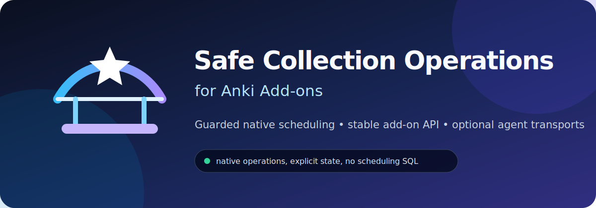
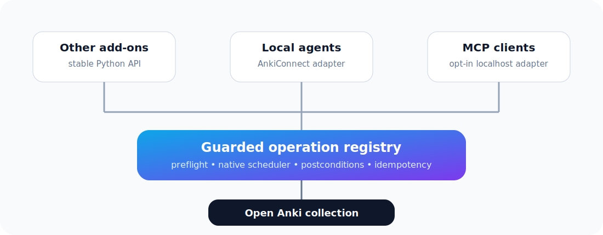

<p align="center">
  
</p>

<p align="center">
  <a href="https://github.com/elvis-sik/anki-addon-safe-collection-operations/actions/workflows/ci.yml"></a>
  
  
  <a href="LICENSE"></a>
</p>

<p align="center">
  A small public utility add-on that gives other Anki add-ons and local agents
  a stable, guarded path to native collection operations that are absent from—or
  unsafe to compose through—AnkiConnect.
</p>

## Why this exists

Anki's native scheduler knows how to handle FSRS, learning steps, filtered
decks, leeches, sibling burying, undo, and revision history. Recreating that
behavior with direct database edits is brittle. Composing multiple remote calls
can be just as risky when one succeeds and the next one fails.

This add-on packages narrow, high-value operations as one audited layer:

- one implementation per operation;
- native Anki APIs only—never direct scheduling-row writes;
- preflight guards and postcondition checks;
- stable result shapes that surface surprising state;
- thin adapters for other add-ons, AnkiConnect, and optional MCP clients.

## First capability: fail any card safely

`fail_cards_now` records an honest native **Again** review even when the card is
not due today.

| Starting state | Native behavior |
|---|---|
| Normal or future card | Browser-grade `Grade Now → Again` |
| Rescheduling filtered deck | One native `Again` in place |
| Preview filtered deck | Native `Easy` exits only the target preview, then native `Again` at home |
| Suspended | Record the failure, then restore suspension |
| Manually buried | Record the failure, then restore manual burial |
| Sibling-buried | Record the failure, then restore scheduler burial |

The result explicitly lists preserved suspension and burial. Clients should
tell the user and offer `make_cards_available`, which removes the hidden state
without erasing the recorded failure.

## One core, three adapters

<p align="center">
  
</p>

### Other add-ons

Import the stable API after add-ons have loaded:

```python
from anki_safe_collection_operations import EventRef, Target, fail_cards_now

result = fail_cards_now(
    mw.col,
    [Target(card_id=123, note_guid="stable-note-guid")],
    event=EventRef(stream_id="my-addon", sequence=1, event_id="review-123"),
)
```

### AnkiConnect

When AnkiConnect is installed, the add-on registers namespaced actions:

- `safeCollectionOperationsCapabilities`
- `safeCollectionOperationsInspectCards`
- `safeCollectionOperationsGetGradingCursor`
- `safeCollectionOperationsFailCardsNow`
- `safeCollectionOperationsMakeCardsAvailable`

These are additions to AnkiConnect, not claims about its stock API.

### MCP

The optional MCP adapter is disabled by default. When enabled, it exposes the
same curated operation registry over authenticated localhost HTTP. The MCP
transport is an adapter, not the source of truth, and never exposes arbitrary
Python, `_backend`, or SQL execution.

## Safety contract

- Run collection access on Anki's main thread.
- Address exact card IDs; never combine a broad search and mutation invisibly.
- Include note GUIDs for agent-originated writes so stale mappings fail closed.
- Reuse the same event stream position when retrying an uncertain request.
- Never switch from the desktop writer to another synced writer after an
  ambiguous timeout.
- Report preserved hidden state and offer to make affected cards available.

See [API.md](docs/API.md) and [SECURITY.md](SECURITY.md) for the complete public
contract.

## Development

```bash
make check
```

The build produces `dist/anki-addon-safe-collection-operations.ankiaddon` and
checks that only the manifest, configuration, bootstrap, and runtime package
are included.

## Status

Early public alpha. The operation surface is intentionally small while the
transaction, filtered-deck, undo, and transport behavior receives real-Anki
coverage. New operations are added for concrete consumers, not to mirror all of
Anki or AnkiConnect.
